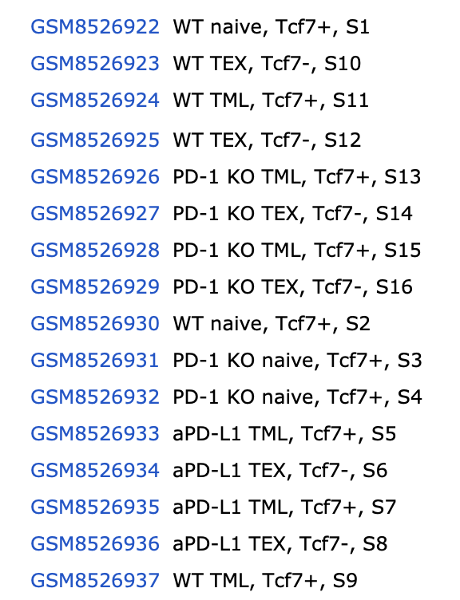

# Bulk RNAseq analysis of GSE277648

## Purpose

This repo is primarily for practice as I learn how to analyze RNAseq
data. I will be documenting my process and findings from analyzing
publically available NCBI data.

## The data

Species: Mus musculus Platform: Illumina HiSeq 4000

Replicates: 2 biological replicates

Experimental design:

-   Infection of mice with a virus called LCMV cl13 normally mimics
    chronic infection and upregulates PD-1, exhausts T-cells, and causes
    immunosuppression.

-   Normally, in chronic infection CD8+ T cells go from Naive →
    Stem-like / memory-like (TML) → Terminally exhausted (TEX). We have
    these 3 cell populations sorted in this experiment and have bulk
    done separately on each population.

    -   **Naive CD8⁺ T cells** are the baseline reference state. They
        have not experienced their antigen yet (LCMV cl13) and are
        highly proliferative, Tcf7 high, PD-1 negative, usually CD44
        low, CD62L high
    -   **TML** are the engine that replenishes TEX cells. TML = T
        memory-like and are also called TCF1⁺ exhausted or stem-like.
        They are a pool of cells that exist during chronic infection to
        proliferate and differentiate into exhausted effector cells to
        maintain a long-term immune response. They are highly
        proliferative, respond to anti-PD-1, and maintain *stemness*, or
        being able to proliferate extensively to replenish TEX cells.
        Normally, TML cells express an intermediate level of PD-1 (less
        than TEX), TCF1 (Tcf7) high, TOX low/intermediate, CXCR5 often
        positive.
    -   **TEX** = T-cell exhausted, are in a fixed, terminally
        differentiated, dysfunctional state after being chronically
        exposed to antigen. They do not proliferate much, have reduced
        cytokine production, high inhibitory receptor expression. Their
        markers are TCF1 (Tcf7) low / negative, PD-1 high, TOX high,
        TIM-3+, LAG-3+. Kind of like burned out cells.

-   PD-1 Reduces acute activation but preserves stemness/self-renewal.
    This is a different role in acute vs. chronic infection.

## Samples

16 samples

{width="235"}

## Questions

-   What happens if TML cells cannot express more PD-1? (PD-1 KO vs.
    WT)?

-   Do our different cell types have the typical expression patterns?
    Naive: Tcf7 high should be obvious since that is how these cells are
    sorted, but what about PD-1 negative, CD44 low, CD62L high?

-   (From AI):

    | Population | What you expect transcriptionally              |
    |------------|------------------------------------------------|
    | Naive      | Quiescence, metabolism, homing genes           |
    | TML        | Stemness, Wnt/TCF signaling, memory programs   |
    | TEX        | Inhibitory receptors, TOX program, dysfunction |
